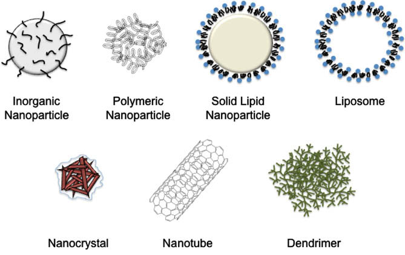

## Nanoparticles in cellular drug delivery
[Link to the full review](https://drive.google.com/file/d/1w8V8RuvdMXEF65-sQ-553kinBt3djfGP/view?usp=sharing)

# Nanoparticle types

**Inorganic nanoparticles**

"Generally, inorganic nanoparticles may be engineered to evade the reticuloendothelial system by varying size and surface composition. Moreover, they may be porous, and provide a physical encasement to protect an entrapped molecular payload from degradation or denaturization. Hollow silica nanoparticles have been prepared, such as calcium phosphate-based nanoshells, with surface
pores leading to a central reservoir. In contrast, mesoporous silica materials contain a complex ‘worm-like’ network of channels throughout the interior of the solid nanoparticles. [...] This work ([by Vallet-Regi et al.](https://drive.google.com/file/d/1-v59M_4qLNrjIc26xk1usO46zONfjxLA/view?usp=sharing)) demonstrated that mesoporous silica materials could be used to deliver relatively large doses of drug in a controlled manner."

"The drug delivery characteristics of mesoporous materials have also been modified via reversible capping of the surface pores. Utilizing the MCM-41 scaffold, Lai et al. developed chemically removable cadmium sulfide (CdS) nanoparticle caps for use as a stimuli-responsive releasing agent for neurotransmitters and drugs. Silica MCM-41 nanoparticles were modified using 2-(propyldisulfanyl)
ethylamine and capped with water-soluble mercaptoacetic acid-derivatized CdS nanocrystals via an amidation reaction. The disulfide linkages were shown to be labile and chemically cleavable by disulfide reducing agents. **The release rate from mesoporous silica materials was dependent on the rate of CdS cap removal**. Analogous methods for controlling the release of drug payloads from silica nanomaterials have been employed by the same group using dendrimer and magnetic caps. As the CdS example illustrated with modifications of 2-(propyldisulfanyl)ethylamine, several functional groups can be introduced onto the surface of inorganic nanoparticles. Inorganic nanoparticles are relatively stable over broad ranges of temperature and pH, yet their lack of biodegradation and slow dissolution raises safety questions, especially for longterm administration."

**Other particles**

This review also lists the properties of polymeric nanoparticles, solid lipid nanoparticles, nanotubes, liposomes, dendrimers and nanocrystals which are not relevant to our current research so I will not include them in the summary.

# Nanoparticle synthesis and conjugation methodologies

**Silica nanoparticles**

"Silica nanoparticles may be prepared by sol–gel methods, detailed in the works by [Stoeber](https://drive.google.com/file/d/1ilwoGn-pQYADjVFs7X71bsK3dARSEG5s/view?usp=sharing), [Shin](/https://drive.google.com/file/d/1BKUdymYlkJCnTf0NBhtsPmQSpf2-CLKu/view?usp=sharing) and [Vallet-Regi](https://drive.google.com/file/d/18DTI3GIUDYeKdV6FLt7qMdLr-xmdzZlc/view?usp=sharing). As described previously, MCM-41 is a mesoporous silica nanoparticle. These nanoparticles are typically synthesized via similar sol–gel processes in the presence of a surfactant such as C12-trimethylammonium bromide versus C16-trimethylammonium bromide, to control pore sizes. The
relative ease of synthesis and functionalization make silica nanoparticles attractive targets for drug delivery; **however the lack of information on their biodegradation remains a noteworthy
limitation** (in 2009). 

**Other particles**

This review also lists the synthesis of gold nanoparticles, carbon nanotubes, calcium phosphate nanoparticles, layered double hydroxide nanoparticles, iron oxide nanoparticles, fullerenes and quantum dots which are not relevant to our current research so I will not include them in the summary.

# Nanoparticle pharmacokinetics

**Distribution**

"The natural clearance and excretion mechanisms of the human body provide a framework for the rational design of effective nanoparticles for use in medical therapies. systems. The distribution of a drug in a tissue is correlated with the relative amount of cardiac output passing through
that tissue. Accordingly, tissues and organs with high blood flow (brain, liver, heart, intestines, lungs, kidneys, spleen, etc.) may be exposed to higher concentrations of a drug, providing that the drug is able to penetrate into the particular tissue from the vasculature. A physiological parameter (cardiac output) can therefore act as a filter to nanomaterial distribution.

Another passive targeting mechanism involves altering the size of the nanoparticle carrier, which also alters the biological distribution profile. Local injections require an engineering of nanoparticles of slightly larger sizes, on the order of 30–100 nm. The latter size range is sufficient to avoid leakage into capillaries, but also small enough to avoid reticuloendothelial clearance. The distribution properties of the drug ultimately depend on the kinetics of payload
movement from the nanoparticle carrier; fast loss of the drug payload before the nanoparticle reaches its target may result in decreased drug efficacy.

Endothelial damage or alteration may modify the distribution parameters of nanoparticles. Inflammation, solid tumors, and deliberate disruption of endothelia contribute to an increased leakiness that provides vascular contents greater access to extravascular targets. Moreover, the bloodbrain barrier may be weakened by solid tumors such as glioblastoma multiforme, thus providing better distribution of therapeutic agents to the CNS and tumor. Nanoparticles greater than approximately 100–150 nm in diameter will tend to accumulate in tumors due to their poor extravasation from normal vasculature. The presence of disturbed, porous vascular beds at the tumor allows for selective targeting by this passive mechanism. 

While passive targeting relies on a specific physiological parameter to act as a distributive filter, several examples of active targeting are known. **The surface of nanomaterials can be ligated to a biological marker, such as an RGD peptide, an antibody, or an aptamer**."

**Clearance/excretion**

"Whereas larger particles tend to remain localized, smaller particles are better able to clear from a placement site. For example, 60 lm polymeric microparticles composed of a slowly degrading
polymer were locally injected at the sciatic nerve. Eight weeks later, the same microparticles were discovered in quantity at this injection site (click [here](https://drive.google.com/file/d/1wsup1ri_tXf-yjJPG_ZSYLUj_-6I4ZE3/view?usp=sharing) to read full article). Similarly, microparticles (5, 25, 60, and 250 lm) injected into the peritoneum of mice remained there for at least
two weeks. In contrast, nanoparticles of the same material showed almost complete clearance from the peritoneum in the same time frame (click [here](https://drive.google.com/file/d/1tBW6-3tKOc3Oldyiy_LIa1wI9DZctmKY/view?usp=sharing) to read full article). Moreover, the spleens of mice treated with nanoparticles were enlarged and exhibited numerous foamy macrophages, presumably resulting from accumulation of a large amount of polymeric material. This finding obviates the role of the
reticuloendothelial system in removing foreign objects including nanomaterials from the biological milieu.

Nanoparticles must therefore evade the reticuloendothelial system to be effective drug delivery agents. Many strategies for covert delivery may be implemented. Hydrophobic nanoparticles such as unmodified liposomes are rapidly cleared via the reticuloendothelial system. The circulation times of these particles can be greatly increased simply by hydrophilic surface modification with PEG. Both clearance and opsonization are influenced by the size and surface characteristics of injected nanoparticles. Particles greater than 200 nm in diameter activate the complement system more efficiently and are cleared more rapidly than very small nanoparticles."

**Toxicity** 

"Many aspects of nanoparticle architecture and composition influence systemic toxicity. Care must be taken regarding the relative size difference between nanoparticles and the vasculature diameter. Particles >5 μm in diameter may embolize these vessels. Moreover, <100 nm particles have a high likelihood of aggregating; thus forming a cluster that can embolize and occlude blood flow.

Alternatively, undesired consequences may also result, including lodging of these aggregates in various organs. For example, intravenous administration of nanoparticles prone to aggregation can result in a pulmonary embolism, strokes, myocardial infarctions, and other microinfarctions at distant sites and organs. Particles up to 4–5 μm in size could be injected directly into the carotid arteries of mice without producing detectable problems, with a caveat that very large quantities were not tested. Thus, nanoparticle administration should result in no adverse embolic phenomena, providing the nanoparticles do not aggregate.

A large body of information reports pulmonary and cardiovascular toxicities. **There are striking parallels between nanomaterials and ‘ultra-fine particles’ in atmospheric pollution**. It has long been known that the lungs and cardiovascular system are particularly susceptible to inflammation and other pathologies following inhalation of these ultra-fine substances. For instance, silica-based particles have been shown to be promoters of inflammation and free radical damage with chronic exposure and in high doses; this phenomenon correlates with devastating pulmonary silicoses. Furthermore, elevated levels of air pollution are associated with an increased incidence of asthma,
life-threatening arrhythmias, and myocardial infarctions. While epidemiological studies do not necessarily define causality, they show a striking correlation with pollutant nanoparticles and
adverse health outcomes.

We may be able to infer that these nanoparticles may promote, if not trigger, low-level systemic inflammation at distant organs and tissues, depending on nanoparticle access to the vasculature via penetration of small blood vessels and capillaries.

One mechanism whereby nanoparticles trigger inflammation involves the generation of **reactive oxygen species (ROS)**. This is believed to be due to the greater surface area of nanoparticles, thus
permitting more interactions with the biological environment and cellular components, and the myriad of transition metals often associated with the preparation of these materials. For instance, interactions between polystyrene nanoparticles and associated transition metals were reported to have a synergistic effect in ROS generation and subsequent inflammation (as shown in the studies done by [D. Brown](https://drive.google.com/file/d/1d_3cznLUzj1jDbkquryIKcXG-vkIbRhu/view?usp=sharing) and [C. Dick](https://drive.google.com/file/d/14qBiJNY6YMbgnp55561O1PwTU2IqhPl3/view?usp=sharing)). Through these studies, some types of nanoparticles were shown to be potent inducers of oxidative stress in macrophages by activating heme oxygenase-1 and depleting intracellular glutathione. Additionally, mice exposed via inhalation to single-wall carbon nanotubes exhibited noteworthy pulmonary pathologic changes at small and high doses. The generalizability of these pulmonary and cardiovascular toxicities to other systems remains unknown."

# Mechanisms of cellular targeting

**Nanoparticle uptake by tissues and cellular phagocytosis/endocytosis**

The information in this section doesn't differ from what's already been stablished abput cellular uptake [here](https://mysecretgarden.netlify.app/wiki/reviewsmall2010vivero). But I'll leave you a cool diagram.

# Nanoparticle drug delivery for human therapeutics

"Nanoparticles have found widespread use in drug delivery, counting more than a dozen FDA-approved variants with indications ranging from cancer to infection."

Then the review detailes cases of neurological cancers, neurovascular diseases and neurodegenerative diseases  and how to (potencially or not) treat them with nanoparticles. Since it's not relevant to our current research, I will not include them in the summary.

# Conclusions

"Nanotechnology will assume an essential place in drug delivery and human therapeutics. A wide variety of nanoparticles exist already, and diverse methods of synthesis have been developed. The pharmacokinetic parameters of these nanoparticles may be altered according to size, shape, and surface functionalization. Careful design of nanoparticle delivery agents will result in successful localization and drug delivery to specific biological targets coupled with the efficient evasion of the reticuloendothelial system. Moreover, nanoparticles can be used to alter the kinetic profiles of drug release, leading to more sustained release of drugs with a reduced requirement for frequent dosing. Particularly interesting applications of nanoparticles in drug delivery relate to the central nervous system and the cardiovascular system. The blood-brain barrier is a formidable challenge for many therapeutic agents; nanotechnology may breach this barrier and establish a new frontier for neuropharmacologic agents." 