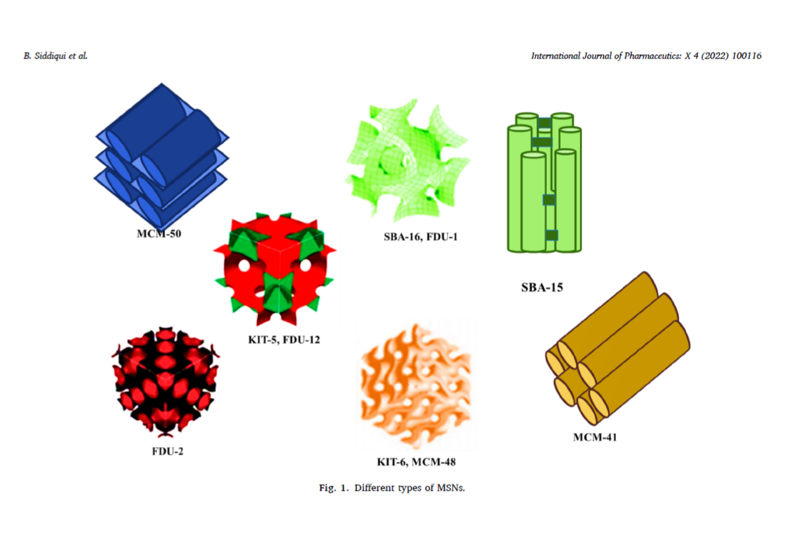
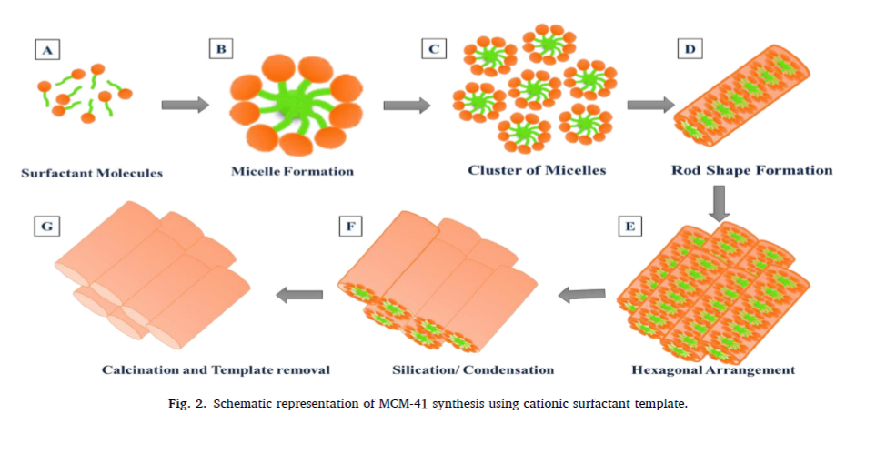
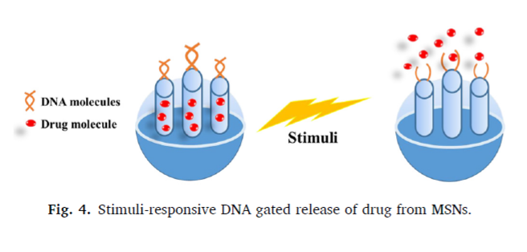

# Exploiting recent trends for the synthesis and surface functionalization of mesoporous silica nanoparticles towards biomedical applications
[Link to the full review](https://drive.google.com/file/d/1eX_K_ZP-gUMxkP0VLoLubnRax4wT1bRk/view?usp=sharing)

Tiene mucha info pero lo vamos a tomar como un ejemplo de como **NO** escribir una review, me costó horrores terminarla, es tan aburrida. 

## Introduction 

"Nanomedicine’s advent in the field of nanotechnology has gained much escalation with the provision of promising solutions towards drug delivery for the treatment of several diseases.These agents are widely employed for the treatment of various dreadful diseases. However, in contrast to organic nanometric agents, the carriers composed of inorganic composition have gained remarkable attention owing to their **higher mechanical, chemical, and thermal stabilities**. These agents mainly include nanocarriers consisting of carbon, metal, or **silica**."

"Nanoporous silica nanoparticles are the inorganic particles having pores in the nano-size of 1-100 nm. These nanopores are categorized as micropores having a diameter of < 2 nm, mesopores of 2-50 nm pore diameter, and macropores with a pore diameter of 50 nm or larger. In the initial phase, they were only employed to increase the solubility of drugs having lower solubility. However, further exploration and advancement in their applications widens their purpose for improving bioavailability, designing controlled drug release, and targeting the active moieties at the desired site."

"The most promising advantages of MSNs as a drug delivery system are their “zero premature controlled release” property. MSNs are highly stable and can deliver large payloads of drugs with precise temporal control. For this purpose, various gatekeepers play a crucial role in controlling the release of drugs by capping the entrances of the carriers and can only be removed under specific conditions. The internal structure of these agents acts as a safer microenvironmental region that serves as effective loading of the therapeutic agent and at the same time its protection from deactivation or degradation from the external environment. These pores of the MSNs may act as drug reservoir systems and permit controlled diffusion of a drug to the surrounding tissues over specified intervals of time upon the influence of any internal (endogenous molecules, redox potential, pH, or biomolecules) or external triggering stimuli (Light, pH, heat, ultrasound,
magnetic field or chemicals)."

"These different gatekeepers may include certain materials acting as hard caps or soft caps. The distinction is made based on the templating method which is being used for the fabrication of porous MSNs.The hard templating method, also called exotemplate, utilizes a porous solid agent, in which inorganic precursor is utilized to fill the hollow spaces of MSNs. While in the soft templating method, also called endotemplate, a surfactant is usually utilized without use of any hard
template. The capping technique also influences the release pattern of the encapsulated agent. The templating agent affects the structural properties of NPs, which in turn affects the release of encapsulated material from their surface, e.g., shell thickness of the carrier."

"Moreover, functionalization of MSNs can be provided by decorating their external surfaces with ligands capable of active targeting at the diseased site. Attachment of one or more stimuli-responsive functional groups to the capped MSNs enables them to release drugs on command. For this purpose, modifications of the silanol groups have been made on the surface of MSNs to create highly modified nanocarriers with remarkable and efficient properties. In addition, all these materials can be phagocytosed by physiological cells without posing any cytotoxicity, which makes these multifunctional MSNs a superior candidate for the site-specific-controlled delivery of drug/gene or any other therapeutic moiety. Herein, we will discuss the types, synthesis techniques, and the recent advancements in the development of novel stimuli-responsive MSNs by various capping molecules. Moreover, we will also focus on the surface modifications of these agents for release
of a therapeutic agent at the target site, upon exposure to internal or external stimuli."

## Types of MSNs

"According to IUPAC, MSNs are materials with an ordered presentation of pores with a 2-50 nm porous
diameter. The sizes of the pores can be altered by employing specific surfactants under suitable reaction conditions (Beck et al., 1992). These surfactants can be of four types based on charges present on them, including cationic surfactants (quaternary ammonium salts or cetyltrimethylammonium
bromide (CTAB)), anionic type (compounds carrying sulfonic acid, phosphoric acid), non-ionic type polyethylene oxide (PEO), and ampholytic type."

"Due to the availability of a wide variety of surfactants, different structures of MSNs have been introduced as shown in Fig. 1."

At this point the review starts explaining de MCM family, the SBA and the FSM but I won't get into it. 

## Advances in synthesis methods

"Synthesis of spherical micron-sized silica nanocarriers was pioneered by St¨ober, by employing specific chemical reactions, and the method was afterward named as ‘St¨ober synthesis’. Mostly St¨ober’s method is followed for the fabrication of MSNs, which is also known as **the sol-gel method**. In the sol-gel method, the sol phase is generated by the reactions of hydrolysis and condensation with the production of colloidal particles at alkaline or acidic pH, while the condensation of colloidal particles results in the production of gel phase of three-dimensional structure through cross-linking of siloxane bond. The condensation process occurs only after hydrolysis reaction, in which repeated condensation forms a chain-like structure in the colloidal solution, while in gel form, it forms a huge network (Danks et al., 2016). Drying of this phase results in the formation of various biomolecules that were embedded in the silica gel matrix resulting in the formation of MCM-41. Through this technique, the produced MSNs are in the micron range, while the alkyl silicates hydrolysis and condensation control the particles’ dispersity in the presence of alcohol. The method utilizes four components; silica source, water, alcohol, and base."

"The other technique for producing MSNs include soft and hard templating methods. In the soft templating method, MSNs are produced through the use of organic templating agents to create porosity. In the next step, heat is provided to remove the templating material and for the
isolation of pure mesoporous carriers. While, in hard templating method or nano casting technique, the precursors of silica fills the templating mesopores through capillary force, followed by the
treatment of chemical or thermal removal of the templating agent, that produces a mirror image of mesoporous silica structure (reverse structure)."

"Hydrothermal technique for the development of MSNs was discovered by Roderick Murchison, a British Geologist. He introduced it as the formation of minerals that were obtained by the hot water solutions from cooling magmas. The process can be described as the reaction occurring in the sealed container where the system’s pressure and temperature are kept high. The method follows
similar steps to that of the sol-gel process, except that the mixture is transferred to an autoclave having a lining of Teflon at a certain temperature, followed by the template removal. MSNs obtained through this method have improved regularity and greater hydrothermal stability."

## Factors that affect cellular uptake and drug loading in MSNs

*Size of MSNs*

"Particle size is one of the most crucial factors that affect the carrier properties and deliver the entrapped agent to the target site. Particles of smaller diameter are usually preferable for effective delivery of the agent with better cellular uptake properties. The particle size of the
MSNs is affected by a variety of factors such as pH, temperature, reaction time, the addition of functional organo-silanes."

The review does a thorough description of how these factors can modify the particle size, I won't get into it, to read it go to the full review (link above).

*Pore size*

"Pore size is one of the essential parameters of MSNs for loading a variety of drug bio-macromolecules. Self-assembly of surfactant molecules with the silica precursor leads to the formation of MSNs with various pore sizes. These pores are formed upon the removal of charged
surfactant molecules. Several attempts have been made to synthesize MSNs with uniform pore sizes with
highly ordered hexagonal regular structures. The persistent urge to obtain large pores of MSNs for the accommodation of carrier drug molecules brought the discovery of MSNs in 1992." 

"Surfactant selection plays a key role in ordering MSNs and affects their pore size. It was postulated that the sizes of the pores could be expanded by employing new templating materials. Pore sizes of the MSNs carriers can be varied by using surfactants of various chain lengths. The surfactants having longer chain lengths will form MSNs of larger pores in comparison to the surfactants of shorter chain lengths."

The review does a thorough description of how different surfactants can modify the pore size, I won't get into it, to read it go to the full review (link above).

*Shape of MSNs*

"The MSNs shape plays an important role in the cellular uptake and trafficking of MSNs into cells. Trewyn et al. showed that tubular MSNs achieve more efficient uptake by normal and cancerous cells than those of spherical shape. This suggests the impact of different shapes on cellular uptake behavior".

"The molar concentration of TEOS, surfactant, base catalyst, and water affects the morphology of MSNs. Non-spherical MSNs can be of cube shape, rod-like, ellipsoid, sheet or film-like materials. However, spherical MSNs have more potential in drug delivery in comparison to non-spherical MSNs."

The review does a thorough description of how different factors can modify the particle shape, I won't get into it, to read it go to the full review (link above).

## Surface modification and functionalization of MSNs for drug delivery

"Various modifications have been made on the surfaces of MSNs for imparting desired properties which may include controlling the drug release profile or improving the loading capacity of the drug, together with reduction of toxicity profile in comparison to free drug. Surface chemical modification in MSNs can significantly increase the targeted delivery of drug with an increase
uptake in affected cells. **Modification can be performed by attaching different functional groups with characteristic features that alter the environmental interface of nanocarriers**, thereby controlling their undesirable biological fluids interactions. These functional groups include
amino groups containing polymers (polyethylene-glycol, dendrimers, polyethyleneimine, phospholipids), thiols, organic phosphates, etc. Chemical moieties can also be attached or adsorbed onto the external surface of MSNs, especially to the surface of silica, by either covalent
linkage or electrostatic interactions. Positively charged moieties interact with the negatively charged silica surfaces to impart desirable features to the MSNs. Modification can be made to their internal surface by grafting (post-synthesis functionalization) or cocondensation (in-situ functionalization), enabling their wider use in various applications. In comparison to the grafting modification, the technique of co-condensation provides improved bonding properties between the porous walls of MSNs with subsequent organic groups. This results in the development of a more homogenous structure of organic functional groups onto the porous structure of MSNs."

"In this respect, various approaches have been developed in order to control the release of a drug; that may include applications of different polymeric combinations that may form firm bonds covalently or either form surface adsorption onto the cargo. The carriers releases the drug upon exposure to either external or internal stimuli by either uncoiling or swelling. Different groups used in the functionalization of MSNs are discussed below."

*Chitosan*

"Polysaccharides have gained immense importance to be used as gate keepers due to a variety of attractive features. Among these polysaccharides, Chitosan is one of the remarkable polymer,
that has been extensively utilized as gate keeping agent for MSNs. Chitosan, a linear polysaccharide having basic properties, is widely used as a capping agent for MSNs due to its higher biocompatibility and biodegradability. Moreover, the molecular weight and degree of deacetylation of chitosan also greatly affect its properties and functionalities."

"Different studies reported the capping of MSNs with chitosan through the attachment of functional groups for targeting the drug at the required site by making it responsive to specific stimuli. Among these, the changing pH is extensively studied on account of the fact that most tumors have an acidic microenvironment. Therefore, chitosan is mostly studied as capping material for MSNs as a pH-responsive gatekeeper."

"Chitosan being a cationic polymer, also improves the loading of genes and related molecules. Lin et al. reported the co-delivery of Doxorubicin and p53 gene through MSNs modified with dendronized
chitosan that acts as a ‘gate keeping agent’ for the achievement of combination therapy with zero premature drug release."

"The polymer also allows grafting of other active ligands for the design of site-specific targeted delivery. Yan et el. developed safe and biodegradable hollow MSNs by capping chitosan polymer on its outer surface that was further linked with glycidoxypropyl-tri-methoxy-silane (GPTMS) through siloxy bonding."

"Functionalization of MSNs through Chitosan is advantageous in terms of its natural origin, increase biocompatibility, and biodegradability with non-toxic profile, which imparts useful characteristics to MSNs in terms of biocompatibility and degradation. Also, the carrier is present with innate properties of anti-inflammatory, anti-bacterial, and mucoadhesive characteristics."

*Multifunctional polymers*

"Various polysaccharides can be employed as gatekeepers due to the presence of their tunable surface, ease of synthesis, low toxicity profile, abundance in nature, and excellent biocompatibility. In this kind of approach, multiple layers of the polymers can be capped on the surface of MSNs for the implementation of the desired properties. These multilayered capping strategies are biocompatible and also allow functionalization to the MSNs surface." 

"Functionalizing MSNs with different polymeric agents helps design a more advanced nanocomplex, combining advantages of different polymers. Polycationic complexes with MSNs are more advantageous and versatile with promising biological applications. Alginate, an acidic polysaccharide that combines with the basic chitosan through multilayered coatings, provides increased protection to the loaded cargoes. In this way, this kind of polymeric system is not only advantageous to increase
the biocompatibility of the polymer but is also helpful in effective functionalization with a more shielding effect. The layering of different polymers on the surface of MSNs helps provide enhanced biomedical activities, i.e., a study demonstrated enhanced anti-cancerous activity after surface decoration of MSN with PEG and PEI than a single layer of chitosan. However, by implementing this strategy, the particle size and the release characteristics of the carrier can be altered. A detailed study should be performed to evaluate the in vivo fate of these carriers."

*Dextrin*

"Dextrin is another low molecular weight starch derivative and has been widely used for the capping of MSNs surfaces. It is commonly used as a gate capping agent for the design of pH-sensitive MSNs with more water solubility."

"The advantage of dextrin functionalization helps to impart greater bio-compatibility and bio-degradability to the MSNs nanocarriers. Moreover, the polymer is also of lower molecular weight and can be utilized as a superior capping agent for the release of targeted drug delivery. However, the disadvantage associated with the polymers is their low stability profile."

*Hyaluronic acid*

"In 1934, a chemical substance from bovine eyes containing two sugar molecules was isolated by Karl Meyer and John Palmer and was termed as ‘hyaluronic acid’ due to the presence of uronic acid (one sugar molecule) and its isolation from hyaloid (vitreous body) of bovine eyes. Further research demonstrated that the molecule is composed of non-sulfated glycosaminoglycan (polysaccharide composed of monomers of N-acetyl-D-glucosamine molecules joined together by -1, 3, and -1, 4 glycosidic linkages. It is considered as one of the vital biopolymers playing an important role in a
number of physiological activities."

"The polymer is negatively charged, having non-immunogenicity, increased biodegradability, and biocompatibility. Moreover, its increasing ability to target a variety of chemical receptors like CD-44 (Cluster of Differentiation 44), CD-168 (Cluster of Differentiation 168, playing a role in wound healing), RHAMM (receptor for hyaluronan mediated motility), Toll-like receptors, HARE (HA receptor for endocytosis) plays an important function in cellular internalization of nanocarriers at the targeted site. Moreover, the polymer degrades by the action of hyaluronidase-1 (lysosomal enzyme) into fragments of lower molecular weight."

"The advantage of functionalization of MSNs with hyaluronic acid resulted in the formation of MSNs with high bio-degradability and biocompatibility. Moreover, a study reported the effect of different chains of hyaluronic acid on MSN properties. The smaller diameter of particles was obtained with a high molecular weight of hyaluronic acid, with efficient internalization through the process of endocytosis. This is due to the multipoint attachment of longer hyaluronic acid chains and its entanglement on the MSN surface, which produces particles of smaller size. However, the technique requires extensive in vivo studies for the determination of bio-distribution and
fate of MSNs."

*Amino groups*

"Functionalization with amino groups can be done on the matrices of MSNs for the control of drug interaction with the matrix surface that further controls its release rate. Amino-tagged MSNs were developed especially for the better interaction of siRNA. The MSNs shell having a negative charge is being functionalized with the positively charged blocks of amino acid for the development of a highly efficient delivery system."

"The amino-functionalized MSNs are more frequently utilized for siRNA delivery. The MSN shell having a negative charge is normally functionalized with the cationic co-polymer with the production of an advanced capped system, having an efficient binding ability. The system helps in the delivery of loaded cargo at the targeted site by uncapping through an endosomal pathway. The presence of multi-amine moieties enhances the affinities of siRNA with the particles. The main disadvantage of this method is the hindrance of the release of siRNA in the cytoplasm due to the formation of strong polyplexes, which ultimately decreases the efficacy of siRNA, also called ‘vector unpacking.’ The second main disadvantage of this method is polycation cytotoxicity, raising the concern about the nanocarrier’s toxicity."

*Nucleic acids*

"Nucleic acids are recognized as one of the most attractive building molecules due to their specific sequence, polymorphic conformation, and versatile physicochemical attributes. Due to their universal properties, DNA molecules are designed to fabricate stimuli-responsive MSNs with intelligent and on-demand delivery of the required therapeutic agent. Researchers developed various strategies for achieving targeted delivery using DNA molecules by complexing DNA molecules with agents that act as gatekeepers and release drugs at the target site in response to the specific stimuli as depicted in Fig. 4."

"Functionalization of MSNs with nucleic acid helps in more precise manipulation of nanocarriers with the opportunity to develop MSNs in larger quantities. This allows the MSNs to combine with the nucleic acids with the development of a unique and more precise nanostructure, which removes only under the influence of specific stimulus. However, the method requires the determination of more sequences of reactions to identify specific interactions and binding properties of these agents with
MSNs. General scheme of stimuli-responsive DNA gated release of drug from MSNs is shown in Fig. 4"

## Mesoporous silica nanoparticles (MSNs) for co-delivery of nucleic acids and small-molecular drugs for cancer therapy

In this part of the review there's a focus on cancer therapy and since that's not relevant for our research I'm not going to include it in the summary. For more information go to the full review.

## Biomedical applications of MSNs

"It is becoming increasingly evident that MSNs hold strong potential as carriers for biomedical applications. Multifunctional MSNs, which typically range from 50 to 3000 nm in diameter, exhibit numerous outstanding properties, including large surface areas and pore volume with high loading efficiency, tunable release mechanisms, and easy surface decoration by attaching ligands for active targeting. These characteristics of MSNs created a vast era of formulation development in the field of nanomedicine. MSNs found their immense importance in different areas of drug targeting (Bagheri et al., 2021; Murugan et al.,2013), tissue engineering [(Nekounam et al., 2021)](/https://drive.google.com/file/d/1tj05iNReKJ4Vr2mQpXut2ko4FjpZHxrY/view?usp=sharing) [(Pouroutzidou et al.,2021)](/https://drive.google.com/file/d/1CcJVmcf09V9MtojkI0Jg2D0Bh816NSAJ/view?usp=sharing), cell tracking (Kim et al., 2021; Umehara et al., 2021), and genes transfection (Hosseinpour et al., 2021) due to their peculiar characteristics of large surface properties, tremendous internal volume and unique channels that facilitate the adsorption of various protein and drugs. Capping agents can control the behavior of pores opening and closing, hence controlling the precise spatial and temporal release of encapsulated material with characteristics of lower degradation kinetics."

"MSNs are also ideal candidates as bio-catalysts due to their increased adsorption capacity and increased surface area. The enzymes can be encapsulated efficiently with high stability and act as bio-catalysts for intercellular bioanalysis. Luciferin-loaded nanocarriers in MSN pores through disulfide bonding with conjugation of PEGylated luciferase enzyme were developed for identification of self-catalyst luminescence for detection of the tumor. In the presence of redox potential and ATP, the release of luciferase catalyzed luciferin with the emission of luminescence. This system provides a unique platform for tumor development and its therapeutic response to treatment."

## Safety, biodistribution, and fate of the MSNs

"Despite various biomedical applications of MSNs, the Food and Drug Administration hasn’t approved MSNs for medical applications until their final fate, bio-distribution, and clearance routes have been addressed. In general, any administered agent undergoes the process of absorption, distribution, metabolism, and clearance. Most commonly, the nanocarriers are administered through subcutaneous or intravenous routes. The injection of these nanocarriers into the bloodstream prompts
rapid bio-distribution of these agents through the bloodstream. However, the stability of these nanocarriers is an important determinant factor that decides their ultimate biomedical use. These carriers must be robust enough for the protection of loaded carriers in the bloodstream and degrade after delivering the cargo at the target site. As, MSNs are composed of SiO2 matrix, which is susceptible to OH- (nucleophilic attack) by water molecules present in the aqueous media, leading to the production of orthosilicic acid in the dissolution media and can be excreted by the urine. The produced acid is watersoluble and helps in the maintenance of bones integrity. Thus FDA announces silica as a safe biomolecule for over 50 years."

"The in vitro degradation rate of the MSNs molecules revealed their long-term stability long enough to guarantee the release of loaded cargo at the site of action. While the in vivo biodegradation of MSNs in different animal models demonstrated increase biodegradation behavior of the carriers having polymeric coatings on outer surfaces. This increases their circulation time in the bloodstream with an increased stability profile. The bio-distribution profile of MSNs demonstrated their accumulation in the reticuloendothelial system, including the liver, lungs, and spleen. This is due to the adsorption of proteins on their external surfaces."

"Different studies have been performed regarding renal clearance of MSNs from the body. These studies confirmed the increase elimination of these nanocarriers from the renal route. In addition, hepatobiliary excretion and excretion through bile are normally under the influence of proteins adsorption, while excretion through feces is normally governed by aggregation and accumulation of smaller particles."

## Conclusions

"MSNs are one of the most promising approaches in the biomedical field and introduced as superior carriers to cope with the hurdles of limited drug release and premature release of cargo with a better stability profile. Research has been conducted in controlling the structural properties of MSNs, including their morphology, pore size, particle size, and structure ordering. Further, to achieve increased loading of drugs with their precise control of release at a target site, functionalization of MSNs’ surface by an external or internal decoration of functional groups is being explored. The combination of MSNs with other agents and functional groups, including polymeric substances, chemical moieties or nucleic acids, helps to create hybrid MSNs having great potential for various biomedical applications. Surface treatment of MSNs also improves the interaction of nanocarriers with the biological environment and improves the biocompatibility of the carriers. These modified MSNs can be utilized in various biomedical applications for achieving targeted drug delivery and facilitating controlled release kinetics."

"However, despite numerous physio-chemical advantages that led the researchers to develop MSNs for various biomedical applications, especially cancer, there are still some prominent challenges that need to be addressed before achieving any clinical translation. First of all, standardizing the protocols of scalability with reproducibility in the production of MSNs is very important. The carriers should be produced on a larger scale with the same colloidal stability, particle size, and pore area. Any functionalization strategy must be standardized with a depiction of an appropriate stability profile and drug loading capacity. Secondly, the bio-distribution studies must be carried out in different animal models in order to predict the final fate of MSNs. **A mandatory step is to evaluate the toxicological profile of these nanocarriers in human models**. In general, it is quite evident that there is a requirement of proper clinical evaluation of these nanocarriers together with the collaboration of interdisciplinary industrial efforts and other scientists to accelerate the entire process from bench to bed translation"